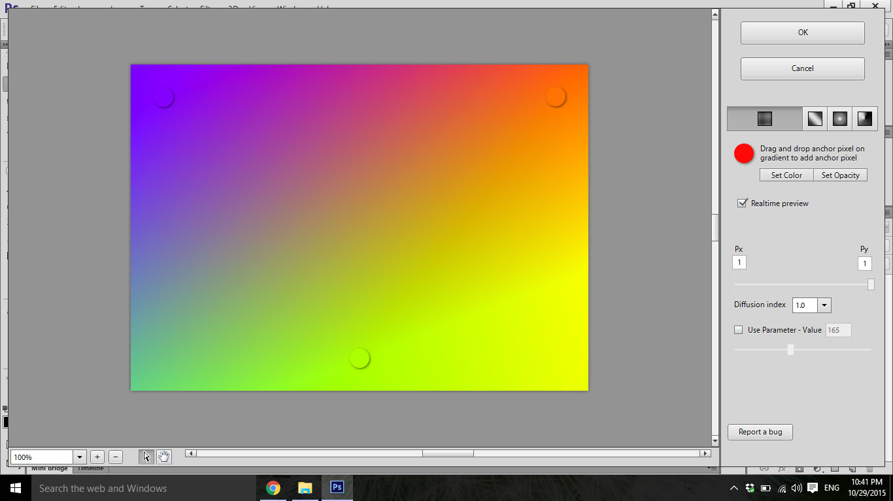

# Smart Gradients Plug-In for Photoshop

Smart Gradients is a plug-in for Photoshop I developed some time ago. Developers interested in development of plug-ins for Photoshop or for some other Adobe product from Creative Suite may find it useful. Designers who want to extend capabilities of Photoshop may found it useful too, however I do not provide binaries.

The plug-in enables user to draw color gradients in real-time and with unprecedented level of control. It is possible to draw classical (legacy) gradients already available in Photoshop (linear, radial and angled), as well as multidimensional gradients which are not currently available. All gradient processing algorithms are written from scratch. You may find multidimensional algorithm outline in AlgorithmDraft.docx. All algorithms seem to be equally fast or faster compared to Photoshop counterparts.

### Disclaimer

Current state of code is decent but far from perfect. I currently do not have bandwidth to improve it. I apologize for any readability issues, hard-coded constants and algorithm implementations which are more complex then actually needed.

## Structure of Repository

**(1) SmartGradients_sln**

SmartGradients_sln contains three Visual Studio Projects:

* core\_SmartGradients\_dll\_cpp - C++ project where actual gradient algorithms are implemented and where interaction with Photoshop takes place. Photoshop exposes C programming interface; thus this project use procedural rather then OOP approach (as code can be ported to Mac more easily). Build output of this project is **SmartGradients.8bf**.

* interface\_GradientControl\_dll\_cs - WPF/C# project where UI is implemented; native code interoperates with C# code via C++/CLI layer in core\_SmartGradients\_dll\_cpp. Build output of this project is **GradientControl.dll**.

* installer\_SmartGradientsInstaller\_exe\_cs - WPF/C# project; primitive installer which automatically finds Photoshop instances on machine and install plug-in. Apart from plug-in, it carries Microsoft Visual C++ Redistributable 2015 and tries to install if missing, hence large output size. Note that this is unified installer for both x86 and x64 distros. Build output of this project is **SmartGradients.exe**

**(2) dependencies**

This directory contains naked C++ header and source files extracted from Adobe Photoshop CS6 SDK, along with [eigen](http://eigen.tuxfamily.org/index.php?title=Main_Page) used for linear algebra. Unfortunately, this directory is very sloppy.

## Build Instructions

(1) Install Visual Studio 2015 with C++ tools.

(2) Open SmartGradients_sln/SmartGradients.sln

(3) Choose appropriate configuration and platform and click Build->BuildSolution

(4) Build artefacts will appear in ./Output directory.

## Install Instructions

You can try running automated installer. If it fails (it might) you can install plug-in manually:

(1) Find Photoshop installation instance; identify platform (x86 or x64)

(2) Copy appropriate version of SmartGradients.8bf (which can be found in ./Output folder) to Photoshop/Plug-ins folder

(3) Copy appropriate version of GradientControl.dll (which can also be found in ./Output folder) to Photoshop folder (same folder as Photoshop.exe)

(4) (Re)start that instance of Photoshop, create new file and run Filter->Smart Gradients Beta->Launch Smart Grtadients

Have fun.

## Short Advice for Folks Who Want to Create Their Plug-In

* Photoshop exposes C programming interface through [Photoshop SDK](http://www.adobe.com/devnet/photoshop/sdk.html). Prepare for a lot of macros, void**s and structures with function pointers. AFAIK, C/C++ is still the only true option for writing plug-ins which work with image buffers. 

* Photoshop SDK contains decent amount of documentation, however it lacks good tutorials. Examples are not very easy either if you are not familiar with Win32. Sample which was especially useful to me was poormanstypetool.

* There is very few tutorials for writing a plug-in. [This](http://www.mactech.com/articles/mactech/Vol.15/15.04/PhotoshopPlug-InsPart1/index.html) 2-part article from 1999 is probably the best you can get.

* Best approach is to start from an existing example and make your way through by trial and error.